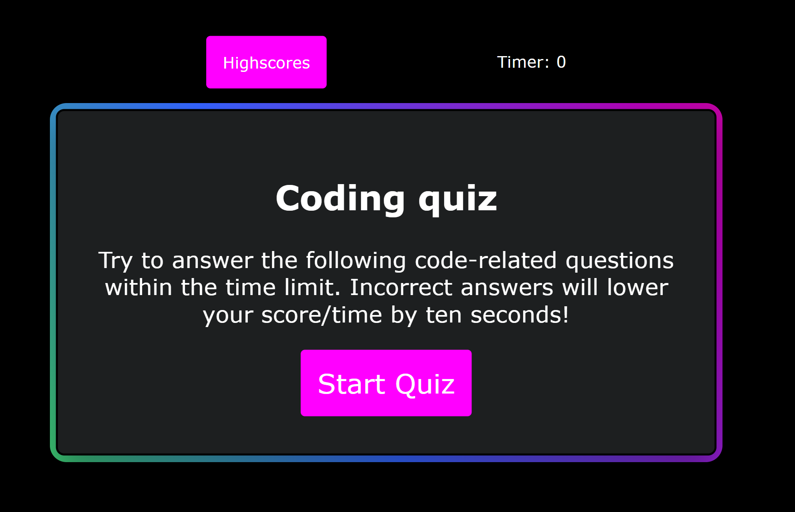

# Coding-quiz

## Description
Bootcamp challenge to create a coding quiz that asks questions about Javascript to help get prepared for job interviews.

Built with:


## Table of Contents
- [User Story](#user-story)
- [Acceptance Criteria](#acceptance-criteria)
- [Usage](#usage)
- [Credits](#credits)
- [License](#license)

## Web link
 https://alexm745.github.io/coding-quiz/
 
## Mock-up



## User Story
```md
AS A coding boot camp student
I WANT to take a timed quiz on JavaScript fundamentals that stores high scores
SO THAT I can gauge my progress compared to my peers
```
## Acceptance Criteria
```md
GIVEN I am taking a code quiz
WHEN I click the start button
THEN a timer starts and I am presented with a question
WHEN I answer a question
THEN I am presented with another question
WHEN I answer a question incorrectly
THEN time is subtracted from the clock
WHEN all questions are answered or the timer reaches 0
THEN the game is over
WHEN the game is over
THEN I can save my initials and score
```


## Usage
Click on Start Quiz button to go through the quiz and answer questions. Afterwards, you can add your initals to see how you score.

## Credits

[Alexis Merino](https://github.com/AlexM745) 
  

## Contribution
  
If you would like to contribute to the code or improve it you can fork the repository.

## License 
  
[](./LICENSE)
